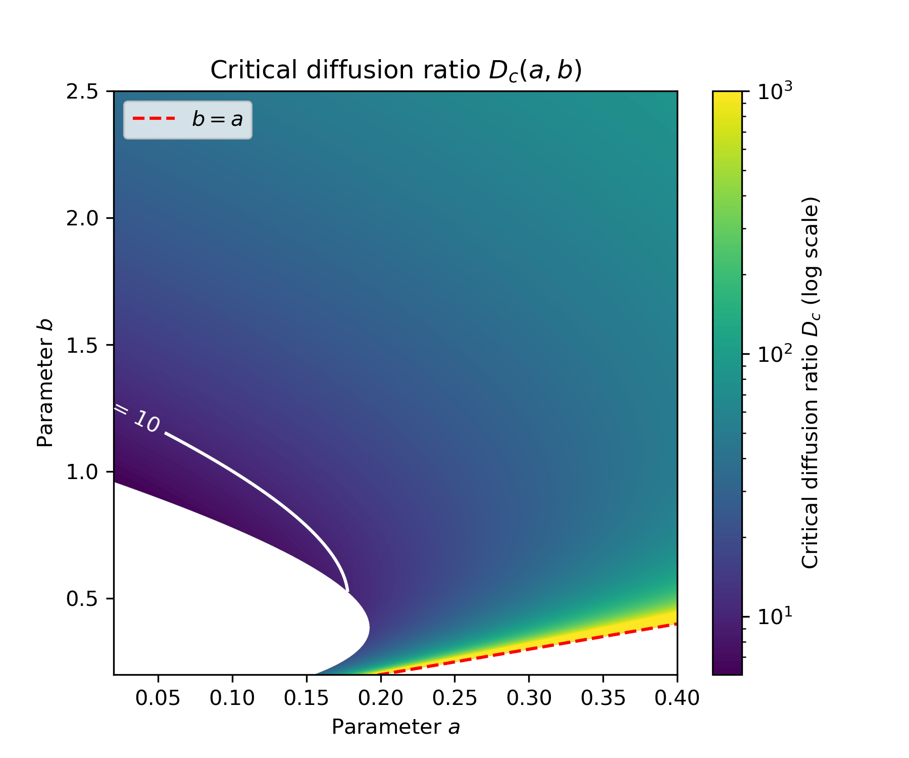
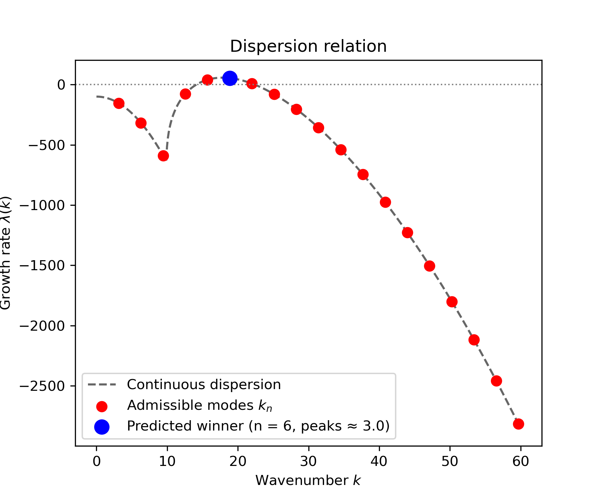
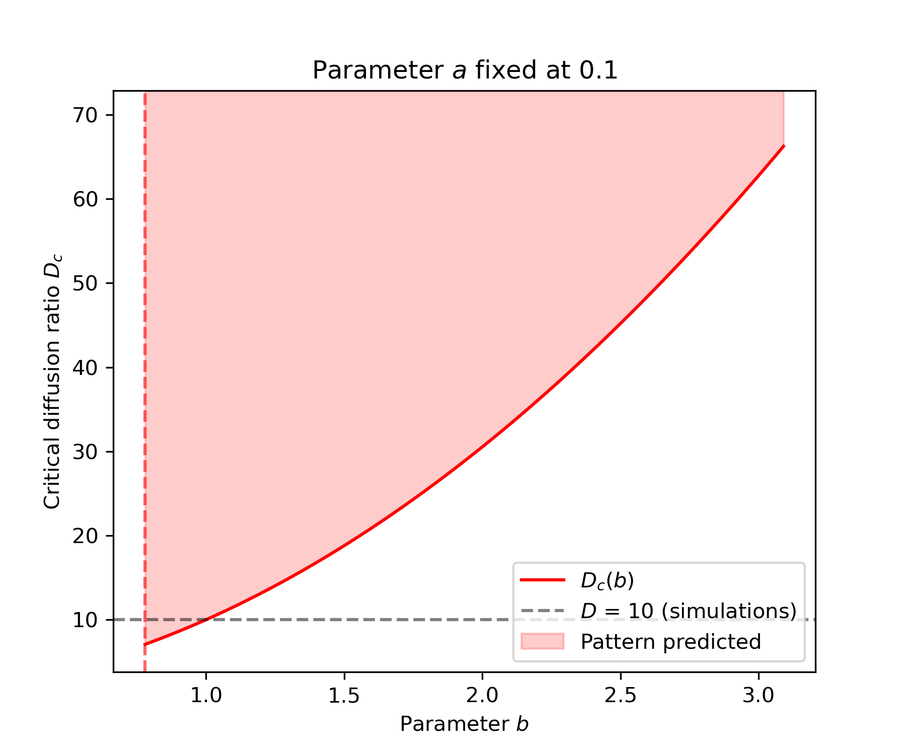
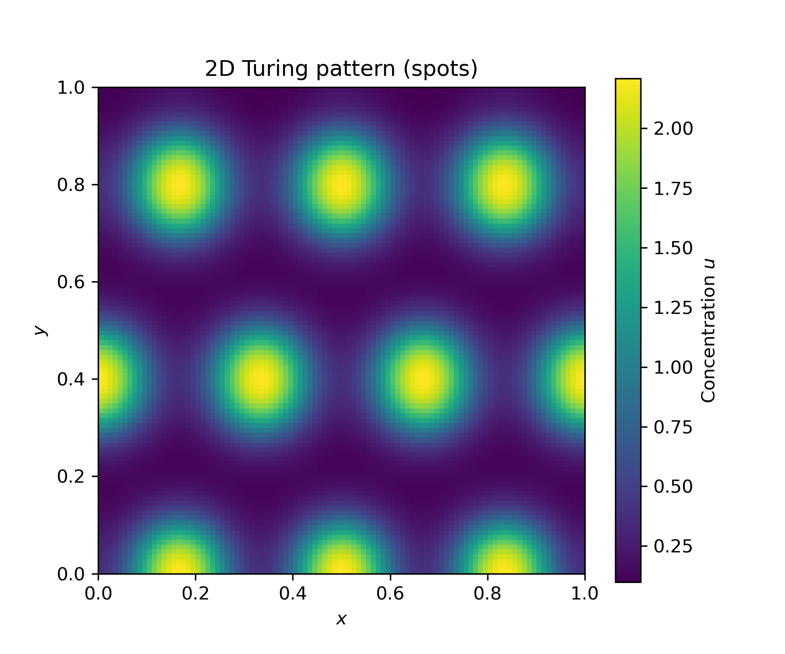

# Turing patterns in the Schnakenberg model

A from-scratch study of diffusion-driven instability: linear stability analysis
derived by hand, implemented in Python, and tested against independent numerical
simulation in one and two dimensions.

The central result is a quantitative prediction confirmed two ways. For the
reference parameters, the critical diffusion ratio is derived analytically as
**D_c = 8.5676**; simulations decay at D = 8.5 and pattern at D = 8.6.



## The model

Two species react and diffuse on a bounded domain with zero-flux boundaries:

$$
\frac{\partial u}{\partial t} = \nabla^2 u + \gamma\,(a - u + u^2 v), \qquad
\frac{\partial v}{\partial t} = D\,\nabla^2 v + \gamma\,(b - u^2 v)
$$

`u` is self-activating through the `u²v` term; `v` is a substrate consumed by
that reaction and replenished at rate `b`. Because `v` diffuses `D` times faster,
depletion spreads outward and suppresses `u` nearby — local activation, lateral
inhibition. `γ` sets the reaction rate relative to diffusion.

The homogeneous steady state is $u^* = a + b$, $v^* = b/(a+b)^2$.

## What linear stability analysis predicts

Perturbing the steady state by a mode of wavenumber $k$ gives growth governed by
$M(k) = J - k^2\,\mathrm{diag}(1, D)$, where $J$ is the Jacobian of the kinetics.
A Turing instability requires:

1. **The uniform state is stable without diffusion:** $\mathrm{tr}\,J < 0$ and
   $\det J > 0$.
2. **Diffusion destabilises some finite $k$:** $\det M(k) < 0$ for some $k > 0$.

Writing $\det M = A z^2 + Bz + C$ with $z = k^2$, condition 2 needs $B < 0$ and
$B^2 - 4AC > 0$. The threshold $D_c$ is the upper root of that discriminant in $D$.

Three results follow directly and are checked in the code:

- **γ does not affect whether a pattern forms.** It factors out of the discriminant
  as $\gamma^2$, so $D_c$ depends only on $(a, b)$. It does set the wavelength:
  $k^2_{\max} \propto \gamma$. Existence is set by the kinetics' structure and the
  diffusion ratio; length scale is set by the reaction rate.
- **Self-activation requires $b > a$.** The condition $\partial f/\partial u > 0$
  reduces to $(b - a)/(a + b) > 0$.
- **Only discrete modes exist.** Zero-flux boundaries admit $k_n = n\pi/L$, and
  mode $n$ has $n/2$ peaks. Boundaries fix the pattern's position, not just its
  spacing.

## Results

Reference parameters: $a = 0.1$, $b = 0.9$, $\gamma = 1000$, $L = 1$.

| Quantity | Predicted | Observed |
|---|---|---|
| Threshold $D_c$ | 8.5676 (analytic root) | between 8.5 and 8.6 (simulation) |
| Winning mode at $D = 10$ | $n = 6$ → 3 peaks | 3 peaks |
| Growth rate of $n = 6$ | ≈ 54 | 53.57 |
| $D_c$ at $\gamma$ = 10, 10³, 10⁶ | identical | identical across the $(a,b)$ grid |

Linear theory describes growth from infinitesimal noise. Past onset, nonlinear
competition between neighbouring modes can shift the final peak count by one,
depending on the initial noise.

**The parameter map** has two excluded regions with distinct meanings. Below the
trace boundary, the uniform state is unstable without diffusion (Turing–Hopf
territory, not a pure Turing instability). Below the line $b = a$, `u` is not
self-activating and no diffusion ratio can produce a pattern. $D_c$ is smallest
right beside the trace boundary: the least diffusion asymmetry is needed where the
uniform state is closest to destabilising on its own.




**In two dimensions** the linear theory is unchanged with $k^2 = k_x^2 + k_y^2$,
so the threshold and wavelength carry over exactly. What it cannot predict is the
*form* — stripes, spots, or labyrinths all share the same spacing. That choice is
made by the nonlinear terms, and is observed rather than derived here.


(see figures folder for ring and stripe patterns)

## Numerical method

- Explicit Euler time-stepping with a 3-point (1D) or 5-point (2D) Laplacian.
- Zero-flux boundaries by edge-padding, which conserves total mass exactly.
- Timestep $\Delta t = 0.2\,\Delta x^2 / (2\,d\,D_{\max})$ in $d$ dimensions.

The explicit scheme is simple and transparent but expensive: because
$\Delta t \propto \Delta x^2$, cost scales as $N^4$ in 2D. Implicit or spectral
methods remove that restriction.

## Repository layout

```
src/turing/
├── kinetics.py    steady state, reaction terms, Jacobian
├── analysis.py    dispersion matrix, growth rates, critical D
├── solver.py      Laplacian, initial conditions, time integration
└── plotting.py    kymograph, dispersion, threshold map and slice
tests/             one test file per module
notebooks/
├── 01_simulation_1d.ipynb
├── 02_linear_stability.ipynb
└── 03_simulation_2d.ipynb
```

`kinetics` knows only the chemistry; `analysis` and `solver` build on it; `plotting`
draws data it is given and computes nothing. Swapping in different kinetics means
rewriting one module.

## Tests

Most tests check a result against an independent route to the same answer:

- the analytic Jacobian against a finite-difference estimate from the reaction terms
- eigenvalue and trace/determinant growth rates against each other
- $D_c$ against the hand-derived quadratic root
- growth-rate sign change across $D_c$
- $\gamma$-invariance of $D_c$
- Laplacian: zero on constants, exact on $x^2$, mass-conserving

## Usage

```bash
git clone https://github.com/Patra-arya/turing_pattern.git
cd turing-pattern
pip install -e .
pytest
```

Requires NumPy, SciPy, Matplotlib, and pytest.

## Next steps

- Implicit or spectral time-stepping to escape the $\Delta t \propto \Delta x^2$ limit.
- General networks: screening arbitrary topologies for Turing instabilities,
  including systems with non-diffusing components (Marcon et al., 2016).
- Coupling chemical patterning to tissue mechanics.

## References

- Turing, A. M. (1952). The chemical basis of morphogenesis. *Phil. Trans. R. Soc. B* 237, 37–72.
- Schnakenberg, J. (1979). Simple chemical reaction systems with limit cycle behaviour. *J. Theor. Biol.* 81, 389–400.
- Murray, J. D. (2003). *Mathematical Biology II*, 3rd ed., ch. 2. Springer.
- Kondo, S. & Miura, T. (2010). Reaction-diffusion model as a framework for understanding biological pattern formation. *Science* 329, 1616–1620.
- Raspopovic, J. et al. (2014). Digit patterning is controlled by a Bmp-Sox9-Wnt Turing network modulated by morphogen gradients. *Science* 345, 566–570.
- Marcon, L., Diego, X., Sharpe, J. & Müller, P. (2016). High-throughput mathematical analysis identifies Turing networks for patterning with equally diffusing signals. *eLife* 5, e14022.

## On AI usage

AI was used to modify and sometimes co-write code. The author takes full responsibility.
